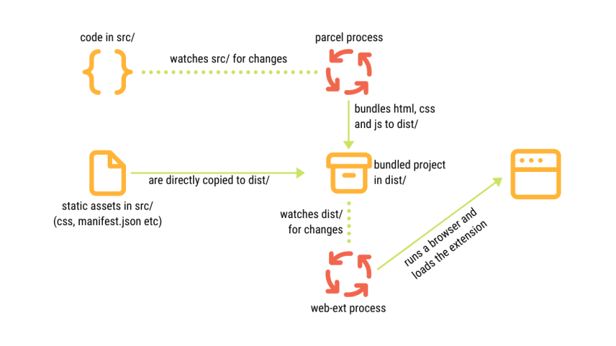

= Marina

Liquid Wallet browser extension

== Testing out the extension

.Build, watch and temporarily install the extension on Firefox
 npm run start

.Or choose your platform
 npm run start:brave-linux
 npm run start:chrome-linux
 npm run start:brave-mac
 npm run start:chrome-mac

.Development environment

== Packaging the extension

.Turn the extesion into a package for submitting to addons.mozilla.org
 npm run web-ext:build

== Tech Stack

* Typescript
* Parcel bundler v1
* React.js
* Tailwind CSS v2

== Browser support

=== webextension-polyfill-ts

This is a TypeScript ready "wrapper" for the WebExtension browser API Polyfill by Mozilla.
Chrome and Firefox are officially supported. Opera and Edge are unofficially supported as a Chrome-compatible target.

* https://github.com/Lusito/webextension-polyfill-ts
* https://github.com/mozilla/webextension-polyfill

=== Safari

The easiest and most cost-efficient way to support Safari is to convert an existing web extension using Xcode’s command-line tool safari-web-extension-converter.
Simply run: xcrun safari-web-extension-converter /path/to/extension

Safari web extensions are available in macOS 11 (Big Sur) and later, and in macOS 10.14.6 (Mojave) or 10.15.6 (Catalina) with Safari 14 installed.

* https://developer.apple.com/documentation/safariservices/safari_web_extensions
* https://developer.apple.com/documentation/safariservices/safari_web_extensions/converting_a_web_extension_for_safari
* https://developer.apple.com/videos/play/wwdc2020/10665/

== Quality Assurance

* Jest testing framework
** https://github.com/kulshekhar/ts-jest
*** TypeScript preprocessor with sourcemap support for Jest
* mockzilla-webextension
** https://lusito.github.io/mockzilla-webextension/
** Mocking toolkit for web-extensions leveraging TypeScript to enhance Jest
** Globally available mockBrowser object to use in tests
* ESLint
** https://www.npmjs.com/package/eslint-config-react-app
* Prettier
** https://github.com/marcosvega91/prettier-tailwind
* https://tsdoc.org[TSDoc]
* React devtool as standalone Electron app
** https://github.com/facebook/react/tree/master/packages/react-devtools#usage-with-react-dom

.Lint and auto-fix the extension source
 npm run lint

.Validate the extension compiled source with web-ext
 npm run web-ext:lint

== Create a Firefox profile to persist preferences

. Launch Firefox this way (on Mac)

 /Applications/Firefox\ Developer\ Edition.app/Contents/MacOS/firefox-bin -P

. Create a dev profile

. Change preferences at url about:config

.. Make Parcel hot reload not blocked by CSP policy: "security.csp.enable" == false
